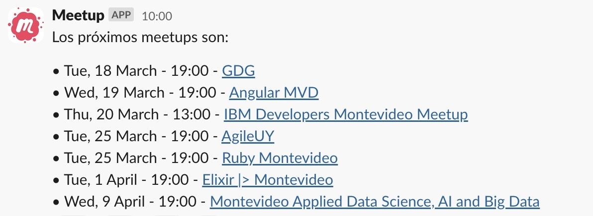

<h1 align="center">
   
  
  
   
</h1>

<h4 align="center">Publish upcoming meetups to Slack</h4>

  

## Requirements

* Elixir ~> 1.16

## Development

Steps to run the application in development

1. Install dependencies `mix deps.get`
2. Start application in development mode `iex -S mix`

## Releasing

Steps to release the application

1. Run `mix release`
